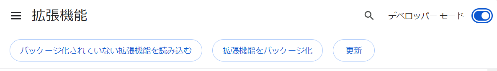
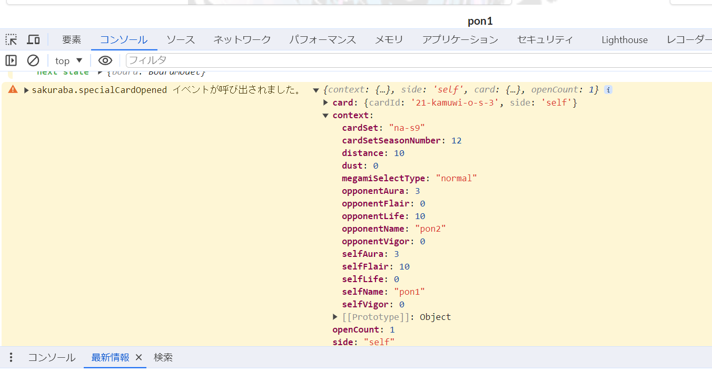

# furuyoni-simulator-event-api-example

[ふるよにボードシミュレーター　拡張イベント API](https://furuyoni-tools-doc.notion.site/API-71e52d2fd2be4767a2c2233afeb87fa4?pvs=4)に対応したChrome拡張機能のサンプルです。

現在は試験的実装の段階です。以下3つのイベントのみに対応しています。

- sakuraba.megamiSelectFinished（選択メガミを公開した）
- sakuraba.reshuffled（再構成を行った）
- sakuraba.specialCardOpened（切り札を表向きにした）

また、以下の差異・制限があります。

- API文書にある「必要な初期設定」を行っていなくても、常にイベントが発行されます。
- sakuraba.specialCardOpenedのopenCountは常に1になります。

## 動かす方法

事前に[Node.js](https://nodejs.org/)のインストールが必要です。

(1) GitHub画面右上の「Code」ボタン →「Download ZIP」ボタンをクリックし、ソースコード一式をzip形式でダウンロードして、任意のフォルダに展開する。

もしくは、gitコマンドでレポジトリをクローンする。

```
% git clone https://github.com/tetradice/furuyoni-simulator-event-api-example.git
```

(2) npmコマンドで必要なパッケージ一式をインストールする。

```
% cd (ソースコードを配置したフォルダ)
% npm install
```

(3) 拡張機能をビルドする。

```
% npm run build
```


(4) Google Chromeの拡張機能画面を開き、画面右上のデベロッパーモードスイッチをONにする。

(5) 「パッケージ化されていない拡張機能を読み込む」ボタンから、ソースコードを配置したフォルダを選択して、上記の拡張機能を読み込む。




(6) [ふるよにボードシミュレーター](https://furuyoni-simulator.herokuapp.com/)にアクセスし、卓を開く。

(7) 「選択メガミを公開」「再構成」「切り札を表向きにする」のいずれかを行った時に、開発ツール上に以下のようなログが出力されていればOK。



あとはソースコード（src/content.ts）内の該当処理を書き換えて、再度 npm run build コマンドでビルドすることで、書き換えた拡張機能を実行させることができます。

※ソースコードの変更時に自動でビルドを行い対場合は、以下のコマンドを実行してください。

```
% npm run watch
```


### 推奨エディタ

Visual Studio Code


### 推奨パッケージマネージャ

pnpm